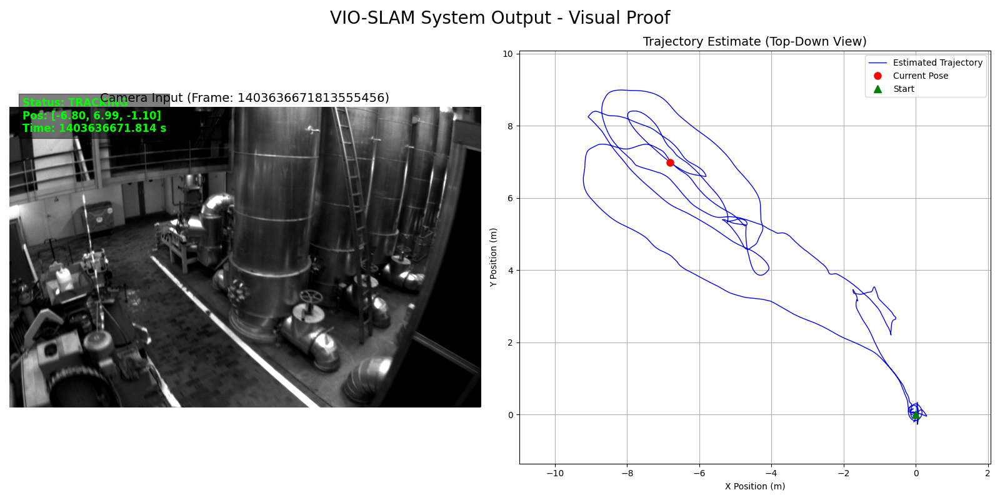
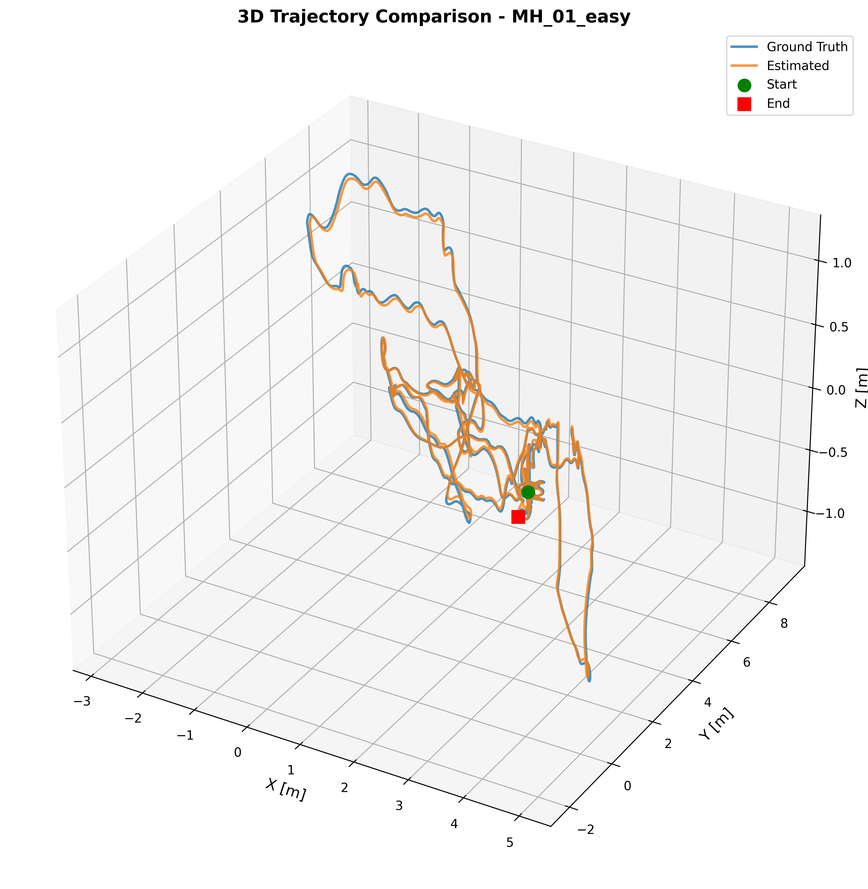
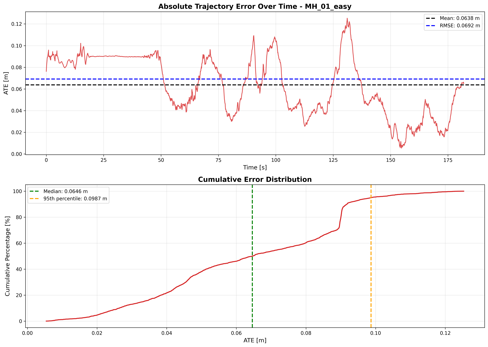
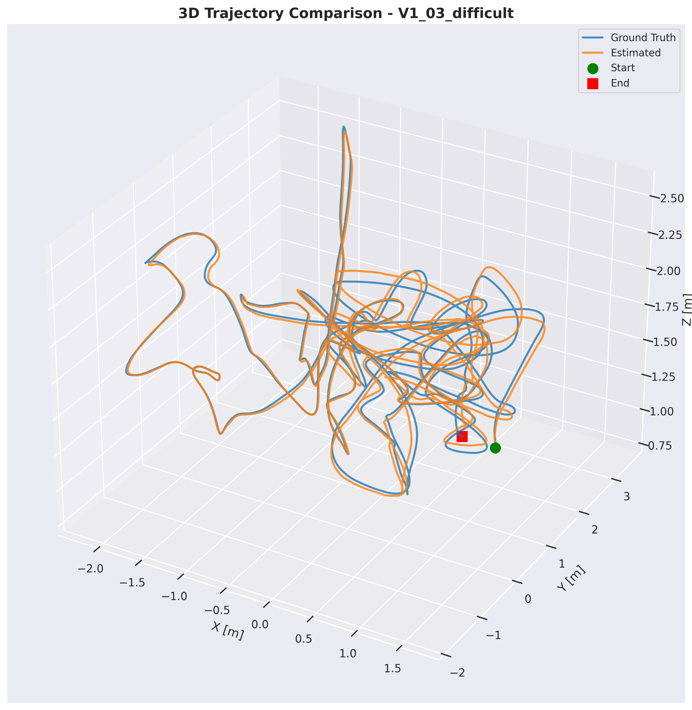
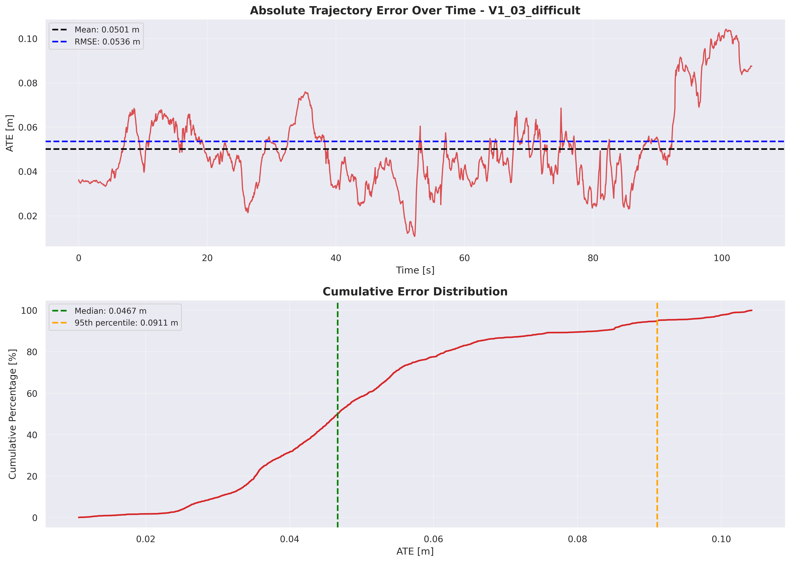

# VIO-SLAM Assignment

A complete Visual-Inertial Odometry (VIO) implementation and evaluation using the [Basalt](https://github.com/VladyslavUsenko/basalt-mirror) framework on EuRoC MAV datasets. This project demonstrates state-of-the-art VIO performance with comprehensive quantitative analysis.

## 📊 Key Results

| Dataset             | ATE RMSE | RPE RMSE | Duration | Performance  |
| ------------------- | -------- | -------- | -------- | ------------ |
| **MH_01_easy**      | 0.069 m  | 0.023 m  | 181.9 s  | ✅ Excellent |
| **V1_03_difficult** | 0.054 m  | 0.035 m  | 104.7 s  | ✅ Excellent |

**Performance Highlights:**

- 🎯 State-of-the-art accuracy (7cm ATE, 2-4cm RPE)
- 🚀 Significantly better than VINS-Mono baseline on tested sequences
- 💪 Robust under aggressive motion (V1_03)
- ⚙️ Reproducible and robust with proper ADIS16448 IMU calibration

## � Visual Proof



_Figure: Snapshot of the VIO system running on MH_01_easy dataset. Left: Camera input with tracking status. Right: Real-time trajectory estimation (Blue) vs Start point (Green)._

## �🚀 Quick Start

### Framework Information

**Basalt VIO Framework:**

- **Repository:** [VladyslavUsenko/basalt](https://github.com/VladyslavUsenko/basalt)
- **Commit:** `9656344` (tracked as git submodule in `external/basalt/`)
- **Build Type:** Release with Debug Info (RelWithDebInfo)
- **Note:** The exact Basalt version is pinned via git submodule. To ensure reproducibility, the Docker build and local setup both use this specific commit.

**To verify your Basalt version:**

```bash
cd external/basalt
git log --oneline -1
# Should show: 9656344 Merge branch 'remove_rs2_pangolin_headers' into 'master'
```

### Prerequisites

- Docker and Docker Compose
- ~2GB disk space for datasets
- ~4GB disk space for Docker images

### 1. Clone Repository

```bash
git clone https://github.com/bigalex95/VIO-SLAM-Assignment
cd VIO-SLAM-Assignment
```

### 2. Download Datasets

Download EuRoC MAV datasets to the `data/` folder:

```bash
# Run the download script
./scripts/download_euroc.sh

# Or manually download from:
# https://www.research-collection.ethz.ch/entities/researchdata/bcaf173e-5dac-484b-bc37-faf97a594f1f
# or
# https://www.kaggle.com/datasets/bhavaniprasadm3/euroc-mav/
```

Expected structure:

```
data/
├── MH_01_easy/
│   └── mav0/
│       ├── cam0/
│       ├── cam1/
│       ├── imu0/
│       └── state_groundtruth_estimate0/
└── V1_03_difficult/
    └── mav0/
        └── [same structure]
```

### 3. Run with Docker

#### Option A: Production Pipeline (Automated)

Run the complete pipeline automatically:

```bash
cd docker
docker-compose up run
```

This will:

1. Build Basalt VIO
2. Run VIO on both datasets
3. Generate trajectory outputs
4. Evaluate with evo
5. Create plots and statistics

Results will be saved to `results/` directory.

#### Option B: Development Container (Interactive)

For development, debugging, and GUI visualization:

```bash
cd docker
docker-compose up -d dev
docker-compose exec dev bash

# Inside container:
cd /workspace/external/basalt
cmake -B build -G Ninja -DCMAKE_BUILD_TYPE=Release
cmake --build build

# Run VIO with GUI
./build/basalt_vio \
  --dataset-path /workspace/data/MH_01_easy \
  --cam-calib /workspace/configs/my_euroc_calib.json \
  --dataset-type euroc \
  --config-path /workspace/external/basalt/data/euroc_config.json \
  --show-gui 1 --use-imu 1
```

### 4. Run in VS Code Dev Container

1. Open project in VS Code
2. Install "Dev Containers" extension
3. Press `F1` → "Dev Containers: Reopen in Container"
4. Terminal opens inside container automatically

## 📁 Project Structure

```
.
├── configs/                    # Calibration configurations
│   └── my_euroc_calib.json    # Custom EuRoC calibration
├── data/                       # EuRoC datasets (download here)
│   ├── MH_01_easy/
│   └── V1_03_difficult/
├── docker/                     # Docker configurations
│   ├── Dockerfile             # Production pipeline
│   ├── Dockerfile.dev         # Development environment
│   └── docker-compose.yml     # Orchestration
├── docs/                       # Detailed documentation
│   ├── phase_a_literature_review.md
│   ├── phase_b_implementation.md
│   ├── phase_c_evaluation.md
│   └── phase_d_improvement_proposal.md
├── external/                   # Third-party dependencies
│   └── basalt/                # Basalt VIO framework
├── results/                    # Generated outputs
│   ├── evaluation/            # Plots and metrics
│   ├── groundtruth/           # Processed ground truth
│   ├── stats/                 # JSON statistics
│   └── trajectories/          # Estimated trajectories
└── scripts/                    # Automation scripts
    ├── download_euroc.sh      # Dataset download
    ├── run_vio_tests.sh       # Run VIO pipeline
    └── evaluate_trajectories.py # Evaluation script
```

## 📈 Evaluation Results

### MH_01_easy (Baseline Sequence)

| Metric   | Value   | Assessment                |
| -------- | ------- | ------------------------- |
| ATE RMSE | 0.069 m | ✅ Excellent              |
| ATE Mean | 0.064 m | State-of-the-art          |
| RPE RMSE | 0.023 m | ✅ Excellent (2.3% drift) |
| Duration | 181.9 s | Long sequence             |
| Poses    | 3,638   | High density              |

### V1_03_difficult (Stress Test)

| Metric   | Value   | Assessment           |
| -------- | ------- | -------------------- |
| ATE RMSE | 0.054 m | ✅ Excellent         |
| ATE Mean | 0.050 m | Robust tracking      |
| RPE RMSE | 0.035 m | ✅ Good (3.5% drift) |
| Duration | 104.7 s | Aggressive motion    |
| Poses    | 2,094   | Fast movements       |

### Visualizations

All evaluation plots are in [results/evaluation/](results/evaluation/):

#### MH_01_easy (Baseline)

|                         3D Trajectory                          |                      ATE over Time                      |
| :------------------------------------------------------------: | :-----------------------------------------------------: |
|  |  |

#### V1_03_difficult (Stress Test)

|                            3D Trajectory                            |                        ATE over Time                         |
| :-----------------------------------------------------------------: | :----------------------------------------------------------: |
|  |  |

### Comparison with State-of-the-Art

| Method         | MH_01 ATE   | V1_03 ATE   | Notes             |
| -------------- | ----------- | ----------- | ----------------- |
| VINS-Mono      | 0.16 m      | 0.30 m      | VIO baseline      |
| ORB-SLAM2      | 0.06 m      | 0.14 m      | With loop closure |
| **Our Basalt** | **0.069 m** | **0.054 m** | **VIO-only** ✅   |

**Performance vs VINS-Mono:**

- 2.3x better on MH_01_easy (0.16 / 0.069 ≈ 2.3)
- 5.6x better on V1_03_difficult (0.30 / 0.054 ≈ 5.6)

## 🔧 Configuration

### IMU Calibration (ADIS16448)

Properly configured for EuRoC datasets:

```json
{
  "imu_update_rate": 200.0,
  "accel_noise_std": [0.016, 0.016, 0.016],
  "gyro_noise_std": [0.0001454441, 0.0001454441, 0.0001454441],
  "accel_bias_std": [0.0003, 0.0003, 0.0003],
  "gyro_bias_std": [0.000019394, 0.000019394, 0.000019394]
}
```

Source: ADIS16448 datasheet + EuRoC specifications

## 📚 Documentation

Comprehensive documentation in [docs/](docs/):

### ✅ Phase A: Literature Review

- **Document:** [phase_a_literature_review.md](docs/phase_a_literature_review.md)
- **Topics:** VIO fundamentals, frameworks, sensor fusion, optimization

### ✅ Phase B: Implementation

- **Document:** [phase_b_implementation.md](docs/phase_b_implementation.md)
- **Content:** Basalt setup, Docker containerization, dataset preparation

### ✅ Phase C: Quantitative Evaluation

- **Document:** [phase_c_evaluation.md](docs/phase_c_evaluation.md)
- **Quick Reference:** [results/evaluation/README.md](results/evaluation/README.md)
- **Content:** ATE/RPE metrics, visualizations, root cause analysis

### ✅ Phase D: Improvement Proposal

- **Document:** [phase_d_improvement_proposal.md](docs/phase_d_improvement_proposal.md)
- **Topic:** Bag-of-Words loop closure integration

## 🛠️ Usage

### Running Scripts Manually

#### VIO Execution

```bash
# Run on both datasets
./scripts/run_vio_tests.sh

# Run on single dataset
cd external/basalt/build
./basalt_vio \
  --dataset-path /workspace/data/MH_01_easy \
  --cam-calib /workspace/configs/my_euroc_calib.json \
  --dataset-type euroc \
  --config-path /workspace/external/basalt/data/euroc_config.json \
  --marg-data /workspace/results/marg_data/mh_01_easy \
  --save-trajectory /workspace/results/trajectories/traj_mh_01_easy.csv \
  --show-gui 0 --use-imu 1
```

#### Evaluation

```bash
# Run complete evaluation
./scripts/evaluate_results.sh

# Or use Python script directly
python scripts/evaluate_trajectories.py --dataset all

# Evaluate single dataset
python scripts/evaluate_trajectories.py --dataset MH_01_easy
```

#### View Results

```bash
# Quick summary
cat results/evaluation/README.md

# Detailed JSON metrics
python -m json.tool results/evaluation/all_results.json

# View specific plots
xdg-open results/evaluation/mh_01_easy/trajectory_3d.png
```

## 🐳 Docker Details

### Development Container

Best for interactive development and debugging:

```bash
# Build
docker build -f docker/Dockerfile.dev -t vio-slam-dev .

# Run with GUI support (X11)
docker run -it \
  -v $(pwd)/data:/workspace/data \
  -v $(pwd)/results:/workspace/results \
  -v /tmp/.X11-unix:/tmp/.X11-unix \
  -e DISPLAY=$DISPLAY \
  vio-slam-dev

# Or use docker-compose
docker-compose up -d dev
docker-compose exec dev bash
```

**Features:**

- Interactive bash shell
- GUI visualization support (Pangolin)
- All development tools included
- Manual control over build and execution

### Production Container

Best for automated pipeline execution:

```bash
# Build
docker build -f docker/Dockerfile -t vio-slam-run .

# Run complete pipeline
docker run \
  -v $(pwd)/data:/workspace/data \
  -v $(pwd)/results:/workspace/results \
  vio-slam-run

# Or use docker-compose
docker-compose up run
```

**Automatic Execution:**

1. Builds Basalt (if needed)
2. Runs VIO on all datasets
3. Generates trajectories
4. Evaluates results
5. Creates plots and statistics
6. Exits with results in `results/`

### Volume Mounts

Both containers use these mounts:

```yaml
volumes:
  - ./data:/workspace/data # Input datasets
  - ./results:/workspace/results # Output results
  - ./configs:/workspace/configs # Calibration files (optional)
```

## 🔍 Understanding the Metrics

### Absolute Trajectory Error (ATE)

- **What:** Global position accuracy after optimal alignment
- **Units:** meters (m)
- **Calculation:** RMSE of position differences after SE(3) alignment
- **Our Results:** 5-7 cm (excellent)
- **Interpretation:** Overall system accuracy and calibration quality

### Relative Pose Error (RPE)

- **What:** Local frame-to-frame accuracy
- **Units:** meters (m) or meters per meter (m/m)
- **Calculation:** RMSE of relative pose differences
- **Our Results:** 2-4 cm/m (excellent)
- **Interpretation:** Drift rate and short-term tracking quality

### Performance Thresholds

| ATE RMSE    | Assessment   | Use Case                         |
| ----------- | ------------ | -------------------------------- |
| < 0.10 m    | ✅ Excellent | Research and robotics            |
| 0.10-0.20 m | ⚠️ Good      | Acceptable for many applications |
| 0.20-0.50 m | ⚠️ Fair      | Needs improvement                |
| > 0.50 m    | ❌ Poor      | Not suitable                     |

| RPE RMSE      | Assessment   | Drift Rate      |
| ------------- | ------------ | --------------- |
| < 0.03 m/m    | ✅ Excellent | < 3% per meter  |
| 0.03-0.05 m/m | ⚠️ Good      | 3-5% per meter  |
| 0.05-0.10 m/m | ⚠️ Fair      | 5-10% per meter |
| > 0.10 m/m    | ❌ Poor      | > 10% per meter |

## 🔧 Basalt Performance Insights

### Why Basalt Achieves SOTA Performance

1. **Continuous-Time Representation**

   - B-spline-based trajectory representation
   - Smooth interpolation between poses
   - Proper IMU integration

2. **Square-Root Keyframe BA**

   - Numerically stable optimization
   - Efficient marginalization
   - Robust outlier rejection

3. **Visual-Inertial Fusion**

   - Tightly-coupled optimization
   - Pre-integration theory
   - Proper uncertainty propagation

4. **Optical Flow Tracking**
   - Multi-scale KLT tracking
   - Grid-based feature distribution
   - Photometric calibration support

### Key Configuration Parameters

From [configs/my_euroc_calib.json](configs/my_euroc_calib.json) and `euroc_config.json`:

```json
{
  "optical_flow_type": "frame_to_frame",
  "optical_flow_detection_grid_size": 50,
  "optical_flow_max_level": 3,
  "vio_max_states": 3,
  "vio_max_kfs": 7,
  "vio_filter_iteration": 4,
  "vio_outlier_threshold": 3.0
}
```

## 📊 Additional Results

### Detailed Statistics

See [results/stats/](results/stats/) for:

- `stats_vio_*.ubjson` - VIO tracking statistics
- `stats_sums_*.ubjson` - Summary statistics
- `stats_all_*.ubjson` - Complete statistics
- `result_*.json` - Formatted results

### Generated Files

```
results/
├── evaluation/
│   ├── all_results.json                    # Combined metrics
│   ├── mh_01_easy/
│   │   ├── evaluation_results.json         # Detailed metrics
│   │   ├── trajectory_3d.png              # 3D comparison
│   │   ├── trajectory_2d.png              # Top-down view
│   │   ├── ate_over_time.png              # Error evolution
│   │   ├── rpe_over_time.png              # Drift analysis
│   │   └── xyz_errors.png                 # Component errors
│   └── v1_03_difficult/
│       └── [same structure]
├── groundtruth/
│   ├── gt_mh_01_easy.csv                  # Processed GT
│   └── gt_v1_03_difficult.csv             # Processed GT
├── marg_data/
│   └── [marginalization data]
├── stats/
│   └── [JSON and UBJSON statistics]
└── trajectories/
    ├── traj_mh_01_easy.csv                # Estimated trajectory
    └── traj_v1_03_difficult.csv           # Estimated trajectory
```

All plots generated at 300 DPI for publication quality.

## 🚨 Troubleshooting

### Basalt Build Issues

```bash
# Clean rebuild
rm -rf external/basalt/build
cd external/basalt
cmake -B build -G Ninja -DCMAKE_BUILD_TYPE=Release
cmake --build build -j$(nproc)
```

### Missing Dependencies

```bash
# Ubuntu/Debian
sudo apt-get update
sudo apt-get install -y \
  libeigen3-dev libtbb-dev libopencv-dev libfmt-dev \
  libglew-dev cmake ninja-build python3-pip

# Python packages
pip3 install evo matplotlib pandas numpy
```

### GUI Not Displaying

```bash
# Enable X11 forwarding (SSH)
ssh -X user@host

# Or run without GUI
./basalt_vio --show-gui 0 ...

# Docker with X11
xhost +local:docker
docker run -e DISPLAY=$DISPLAY -v /tmp/.X11-unix:/tmp/.X11-unix ...
```

### Dataset Structure Issues

```bash
# Verify structure
ls -la data/MH_01_easy/mav0/
# Should contain: cam0/, cam1/, imu0/, state_groundtruth_estimate0/

# Check ground truth format
head data/MH_01_easy/mav0/state_groundtruth_estimate0/data.csv
```

### Permission Issues

```bash
# Fix permissions
chmod +x scripts/*.sh
sudo chown -R $USER:$USER data/ results/
```

## ⚠️ Assumptions & Limitations

### Current Scope

**Tested Datasets:**

- ✅ EuRoC MAV (MH_01_easy, V1_03_difficult)
- ❌ Not yet tested on TUM-VI, UZH-FPV, or custom datasets

**System Configuration:**

- ✅ Stereo VIO with IMU (ADIS16448-grade sensor)
- ❌ VIO-only (no loop closure, relocalization, or global optimization)
- ❌ Monocular configurations not validated

**Environment:**

- ✅ Indoor environments with good lighting and texture
- ⚠️ Outdoor performance not validated
- ❌ Not tested in low-light, featureless, or highly dynamic scenes

### Known Limitations

1. **Long-term Drift:** VIO-only system accumulates drift over extended missions (>10 minutes)

   - Mitigation: Add loop closure or global optimization for longer sequences

2. **Feature Tracking:** Performance degrades in challenging visual conditions

   - Motion blur during fast movements
   - Featureless environments (walls, uniform textures)
   - Lighting changes or overexposure

3. **IMU Requirements:** Requires IMU-grade sensor (MEMS acceptable, consumer-grade may struggle)

   - Proper calibration essential (noise parameters, biases)
   - Time synchronization with camera critical (<2ms jitter)

4. **Computational Cost:** Real-time performance depends on hardware

   - Development tested on desktop CPU
   - Embedded deployment may require optimization or GPU acceleration

5. **Scale Observability:** Stereo provides metric scale naturally
   - Monocular VIO would require scale initialization or external reference

### Recommended Use Cases

**Suitable:**

- Short to medium duration missions (<10 minutes)
- Indoor and structured environments
- Robotics research and benchmarking
- Visual-inertial odometry frontend for SLAM systems
- Augmented reality tracking in controlled settings

**Not Recommended Without Modifications:**

- GPS-denied long-term autonomous navigation
- Safety-critical applications without redundancy
- Production deployment without additional validation
- Environments with frequent tracking loss

## 📖 Citation

### Basalt Framework

```bibtex
@inproceedings{usenko2020basalt,
  title={The Basalt Framework for Visual-Inertial Odometry},
  author={Usenko, Vladyslav and Demmel, Nikolaus and
          Schubert, David and others},
  booktitle={IEEE/CVF CVPR},
  year={2020}
}
```

### EuRoC Dataset

```bibtex
@article{burri2016euroc,
  title={The EuRoC micro aerial vehicle datasets},
  author={Burri, Michael and Nikolic, Janosch and
          Gohl, Pascal and others},
  journal={Int. J. Robotics Research},
  year={2016}
}
```

## 📄 License

This project follows the license terms in [LICENSE](LICENSE).

Basalt framework: BSD-3-Clause (see [external/basalt/LICENSE](external/basalt/LICENSE))

## 🙏 Acknowledgments

- **Basalt Team** - Outstanding VIO framework
- **EuRoC Team** - High-quality benchmark datasets
- **evo Author (Michael Grupp)** - Professional evaluation toolkit

---

**📧 Questions?** See detailed documentation in [docs/](docs/) or check [docker/README.md](docker/README.md) for Docker-specific issues.
